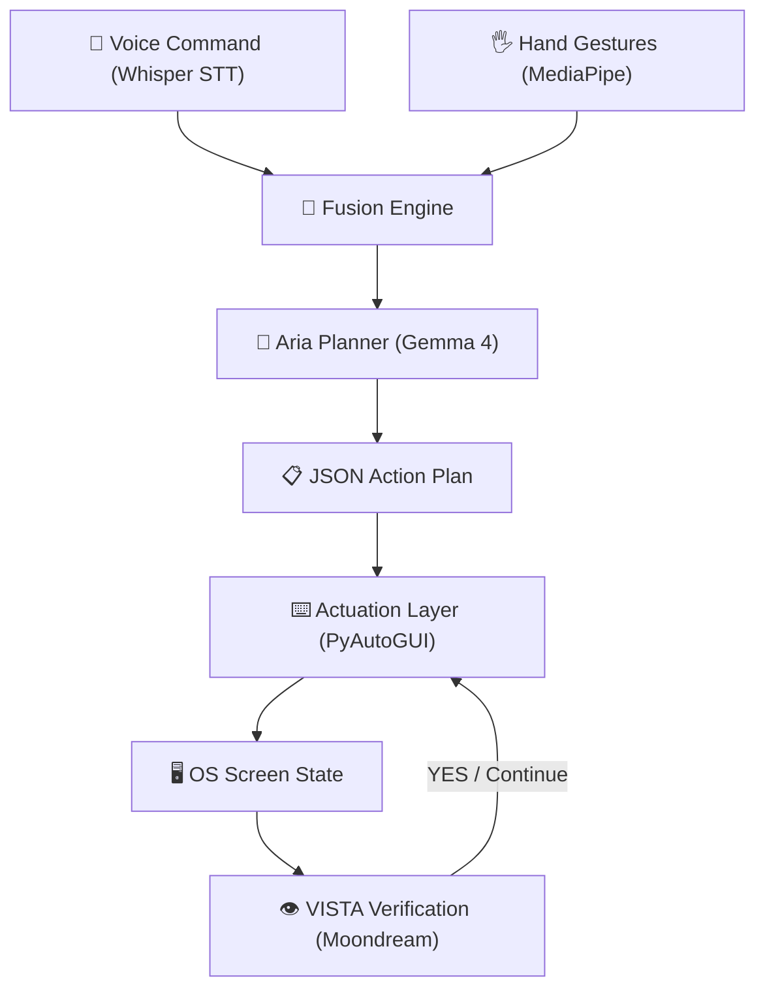

# Servent-AI: Action Intelligence Framework (AIF)

Servent-AI is a 100% local, privacy-first Windows OS automation agent. It enables users to control their operating systems entirely hands-free using natural voice commands and real-time hand gestures. By utilizing local reasoning models (Gemma 4) and vision models (Moondream), Servent-AI autonomously plans and executes complex, multi-step actions on your computer, verifying the visual state of the screen at every step.

This framework is built with **accessibility** at its heart, providing physically challenged or motor-impaired individuals a way to fully operate their computers, write code, and build digital careers independently.

---

## Key Features

* **🎤 Hands-Free Voice Control:** Uses local OpenAI Whisper models to transcribe voice commands (e.g. *"open Gemini, write a letter, and send it to my friend on WhatsApp"*).
* **🖐️ Real-Time Gesture Tracking:** Tracks hand coordinates and finger curls using MediaPipe to control mouse cursor movement, clicks, and page scrolling.
* **🧠 Aria Planning Brain:** Uses Google's **Gemma 4 E4B** (via LM Studio) to convert abstract voice instructions into structured, step-by-step JSON plan arrays.
* **👁️ VISTA Visual Verification:** Automatically captures screenshots and queries a local **Moondream** vision model to verify whether a page loaded or a button became visible before proceeding.
* **🔒 100% Local & Private:** No APIs, no cloud dependencies, no paywalls, and completely offline. Your data never leaves your machine.

---

## Architecture Flow



---

## Prerequisites & Installation

### 1. Set Up Local Models
* **LM Studio:** Download and run [LM Studio](https://lmstudio.ai/). Load **`gemma-4-E4B-it`** and start the local API server on port `1234`.
* **Ollama:** Install [Ollama](https://ollama.com/) and run the following in your terminal to pull the visual model:
  ```bash
  ollama pull moondream
  ```

### 2. Install Project Dependencies
1. Clone the repository:
   ```bash
   git clone https://github.com/Anikesh0415/Servent-AI.git
   cd Servent-AI
   ```
2. Activate your virtual environment and install dependencies:
   ```bash
   .\venv\Scripts\activate
   pip install -r requirements.txt
   ```

---

## Usage

1. Start your local model servers (LM Studio on port `1234` and Ollama on port `11434`).
2. Run the bootstrapper script:
   ```bash
   Start_Ecosystem.bat
   ```
3. Open the locally served dashboard at `ui/index.html`.
4. Speak a command (e.g., *"open Gemini, ask for a letter, and copy it..."*) or use hand gestures to control the cursor!

---

## Contributing & License
Distributed under the MIT License. Feel free to open issues and pull requests to help make computing accessible for everyone!
