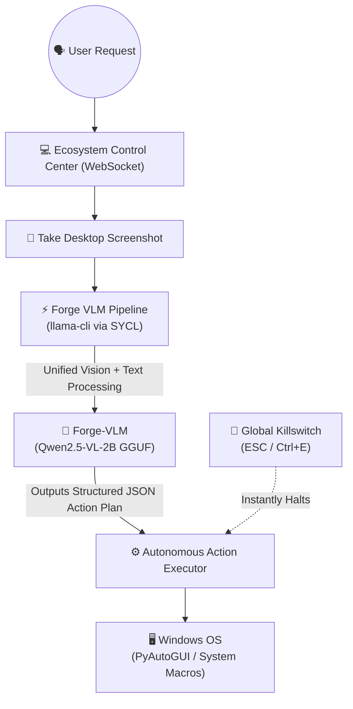

# Forge: Local AI OS Built on Unified Vision-Language Reasoning

Forge is an ultra-efficient, highly optimized Local AI OS automation agent designed to help individuals control their Windows computers using voice commands and text instructions.

Powered by a single, fine-tuned **Qwen2.5-VL-2B (GGUF)** model, Forge operates natively on an **Intel Core Ultra 5 226V (Arc iGPU)** via the `llama.cpp` SYCL backend. This architecture enables low-power (sub-20W), high-efficiency execution while processing desktop screenshots and outputting precise JSON action plans in a single, autonomous step.

---

## 🗺️ Architecture Flowchart


```mermaid
graph TD
    User(("🗣️ User Request")) --> UI["💻 Ecosystem Control Center (WebSocket)"]
    
    %% VLM Pipeline
    UI --> Screenshot["📸 Take Desktop Screenshot"]
    Screenshot --> Inference["⚡ Forge VLM Pipeline\n(llama-cli via SYCL)"]
    
    Inference -->|Unified Vision + Text Processing| Qwen["🧠 Forge-VLM\n(Qwen2.5-VL-2B GGUF)"]
    
    %% Execution
    Qwen -->|Outputs Structured JSON Action Plan| Executor["⚙️ Autonomous Action Executor"]
    
    %% Global Safeguard
    Killswitch["🛑 Global Killswitch\n(ESC / Ctrl+E)"] -.->|Instantly Halts| Executor
    
    %% OS Level Execution
    Executor --> TargetApp["🖥️ Windows OS\n(PyAutoGUI / System Macros)"]
```

---

## ✨ Features

* **🧠 Unified Vision & Reasoning**: Handles both screen perception and action planning simultaneously using a single, fine-tuned Qwen2.5-VL-2B model.
* **⚡ Intel SYCL Hardware Acceleration**: Native iGPU execution via `llama.cpp` maximizes performance on Intel Core Ultra 5 Arc GPUs for ultra-efficient, low-power processing.
* **⚙️ Autonomous Execution & Killswitch**: Features a streamlined auto-execution loop that fires commands directly with a 1.5-second delay. A global **ESC** key abort feature acts as an emergency killswitch to instantly halt operations.
* **🔒 100% Local & Private**: No cloud APIs required. Your screen and data stay completely offline.

---

## 🚀 Prerequisites & Installation

### 1. Build Custom llama.cpp for SYCL
* We use `llama.cpp` compiled specifically for Intel SYCL compatibility to leverage the iGPU.
* Ensure you have the SYCL environment configured and `llama-cli` built.

### 2. Prepare the Model
* Download the quantized model (`qwen2.5-vl-2b.gguf`) and place it in the `models/` directory.

### 3. Install Project Dependencies
1. Clone the repository:
   ```bash
   git clone https://github.com/Anikesh0415/Forge.git
   cd Forge
   ```
2. Activate your virtual environment and install dependencies:
   ```bash
   python -m venv venv
   .\venv\Scripts\activate
   pip install -r requirements.txt
   ```

---

## 💻 Usage

1. **Start the SYCL-Accelerated VLM Server:**
   Run the `llama.cpp` SYCL server natively on your Intel iGPU:
   ```bash
   llama-cli -m models/qwen2.5-vl-2b.gguf -ngl 33
   ```
   *(Ensure your specific SYCL environment variables like `SYCL_PI_LEVEL_ZERO_USE_IMMEDIATE_COMMANDLISTS=1` are set).*

2. **Start Forge:**
   Run the application entry point from the root folder:
   ```bash
   python server.py
   ```
3. Open the locally served dashboard at `ui/index.html`.
4. Type your instruction, and the unified VLM will seamlessly capture your screen, generate an action plan, and automatically execute it!

---

## 🕵️ Shadow Mode (Dataset Collection)

Forge features a **Shadow Mode** designed to quietly build a high-quality RL/SFT fine-tuning dataset while you operate your PC normally. 

When Shadow Mode is active (`python src/shadow_mode.py`), it runs as a non-blocking background listener that:
1. Listens for human mouse clicks using `pynput`.
2. Captures a lightweight screenshot instantly using `mss`.
3. Queries the local Qwen2-VL model in the background to predict what action it *would* have taken.
4. Calculates the pixel error delta (`error_delta = sqrt((ai_x - human_x)^2 + (ai_y - human_y)^2)`).
5. Logs the ground-truth and AI predictions into a JSONL dataset at `./dataset/shadow_dataset.jsonl` along with the images in `./dataset/images/`.

This continuously generates rich training pairs without interrupting your normal workflow!

---

## 🤝 Contributing & License
Distributed under the MIT License. Pull requests are welcome to help harden the system, build new plugins, and improve local execution efficiency!
