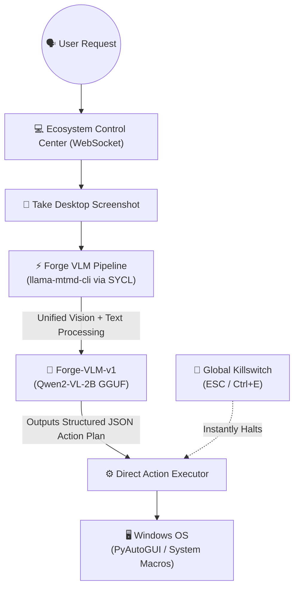

# Forge: Local, Multi-Modal Automation Agent

Forge is a local, privacy-first Windows OS automation agent designed to help individuals control their computers using voice commands and text instructions. 

By utilizing our unified, fine-tuned **Forge-VLM (Qwen2-VL-2B) GGUF** model running entirely locally on Intel Arc iGPU (via SYCL), Forge takes a desktop screenshot and generates a precise JSON action plan in one seamless step.

---

## 🗺️ Architecture Flowchart


```mermaid
graph TD
    User(("🗣️ User Request")) --> UI["💻 Ecosystem Control Center (WebSocket)"]
    
    %% VLM Pipeline
    UI --> Screenshot["📸 Take Desktop Screenshot"]
    Screenshot --> Inference["⚡ Forge VLM Pipeline\n(llama-mtmd-cli via SYCL)"]
    
    Inference -->|Unified Vision + Text Processing| Qwen["🧠 Forge-VLM-v1\n(Qwen2-VL-2B GGUF)"]
    
    %% Execution
    Qwen -->|Outputs Structured JSON Action Plan| Executor["⚙️ Direct Action Executor"]
    
    %% Global Safeguard
    Killswitch["🛑 Global Killswitch\n(ESC / Ctrl+E)"] -.->|Instantly Halts| Executor
    
    %% OS Level Execution
    Executor --> TargetApp["🖥️ Windows OS\n(PyAutoGUI / System Macros)"]
```

---

## Features (Unified VLM Architecture)

* **🧠 End-to-End Multimodal Reasoning**: Replaced separate LLM and Vision models with a single **Qwen2-VL-2B** fine-tune that directly ingests a desktop screenshot and instruction to output a JSON action plan.
* **⚡ Intel Arc SYCL Acceleration**: Custom `llama.cpp` wrapper explicitly optimized for local Intel iGPU environments (`llama-mtmd-cli`).
* **🛑 Global Safety Killswitch**: Press `ESC` or `Ctrl+E` at any time to instantly trigger a PyAutoGUI Failsafe and halt execution.
* **🎯 Coordinate & Semantic Actions**: Extracts UI elements dynamically from the screenshot context, mapping them directly to screen interactions without complex DOM/OCR dependencies.
* **🔒 100% Local & Private**: No cloud APIs required. Your screen and data stay completely offline.

---

## Prerequisites & Installation

### 1. Build Custom llama.cpp
* We use a custom branch of `llama.cpp` tailored for Intel SYCL compatibility.
* Ensure you have the `llama-mtmd-cli` executable built in `src/vlm_pipeline/llama.cpp/build/bin/Release`.

### 2. Export and Merge the Model
* Ensure `Forge-VLM-v1-Q4_K_M.gguf` and `Forge-VLM-v1-mmproj-f16.gguf` exist in `src/vlm_pipeline/export/`.

### 3. Install Project Dependencies
1. Clone the repository:
   ```bash
   git clone https://github.com/Anikesh0415/Forge.git
   cd Forge
   ```
2. Activate your virtual environment and install dependencies:
   ```bash
   python -m venv venv
   .\venv\Scripts\activate
   pip install -r requirements.txt
   ```

---

## Usage

1. Run the server script from the root folder:
   ```bash
   python server.py
   ```
2. Open the locally served dashboard at `ui/index.html`.
3. Type your instruction and the VLM will capture your screen, generate an action plan, and execute it!

---

## Contributing & License
Distributed under the MIT License. Pull requests are welcome to help harden the system, build new plugins, and improve local execution!
